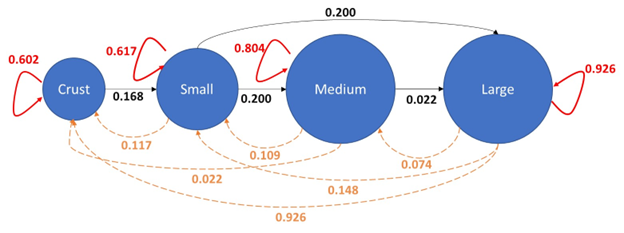

```{r setup, include=FALSE}
knitr::opts_chunk$set(collapse = T, cache = T)
```

## Instructions

Please, using RStudio and R, answer the questions below. You can use the class notes, the recommended books, and other web materials to help answer the questions. You can work on the homework in groups, but please independently send the R code and the answers to the short-essay questions.

**In two weeks (10/21/22)**, please submit your R code (R, text, or HTML file) and short answers (.doc file) to CANVAS using the following filename structure LastName_HW1_Filetype_Date (e.g., Santos_HW1_R\_20210928). Again, you can share and work together on the code, but independently, submit your answers to the short essay questions in your own words. Please, add tables and figures for your answers in your doc file (i.e., do not refer me to the code). If you fill comfortable submitting a markdown or quarto showing both the code and results, the better (optional).

## Data for questions

For this homework, you will use two datasets. For sections 1 and 2, you will use a dataset from the `lterdatasampler` R package <https://lter.github.io/lterdatasampler/> called "and_vertebrates". The `lterdatasampler` R package was created by the NSF LTER program <https://lternet.edu> to provide data examples for educational purposes. This dataset consists of the populations of West Slope cutthroat trout (*Onchorhyncus clarki clarki*) in two standard reaches of Mack Creek in the H.J. Andrews Experimental Forest that have been monitored since 1987. The two standard reaches are in a section of clear-cut forest (ca. 1963) and an upstream old-growth forest (\>500 years). Sub-reaches are sampled with 2-pass electrofishing, and all trout individuals are measured and weighed.

The second dataset is for section 3. This dataset will be available in CANVAS under the HW1 link in the Modules tab. This dataset is titled ["coral_size_projection.csv"](https://raw.githubusercontent.com/PCB5423/BSC6926_workshopScripts/master/data/coral_size_projection.csv). The dataset consists of a projection matrix of coral size transitions that was modified from several reports/papers. In other words, the matrix includes the probability of transition between coral size classes or stages.

## Questions

### Section 1 (21 pts)

1.  Upload "and_vertebrates" into R-Studio (remember you have to download the lterdatasampler R package before). Using R, create a new dataset by selecting only Cutthroat trout data from the lower reach section, then calculate abundance (total number of individuals collected) by sitecode and year for Cutthroat trout. Please, use "Nt" to name the column with the abundance data. Here are details about the "and_vertebrates" data useful to answer this question (look for info in the "Table Column Descriptions" tab in Data Entities - <https://portal.edirepository.org/nis/metadataviewer?packageid=knb-lter-and.4027.14> (5 pts).

2.  Plot annual estimates of trout abundance per sitecode (1 pts).

3.  Short Essay Question 1.1 -- How do the temporal trends of Cutthroat Trout between the sitecode compare (3 pts)?

4.  Using R, calculate lambda from one year to the next (i.e., for each time step) for the two reach (sitecode) you selected. Try using either a for-loop or functions (1 pts).

5.  Calculate the mean(λ) and sd(λ) for the two reaches using your calculation from Q1.4. Remember to use the geometric mean and its standard deviation (1 pts).

6.  Project the population of the three species for up to 50 years using an exponential model with environmental stochasticity. Run the projections ten times for each reach (i.e., ten projections per reach).\

    -   Use the ten as a starting N (N_0), and at each time step, use a randomly determined λ based on the mean and standard deviation calculated in Q1.5 -- Hint: rtruncnorm() function in R and for loops (e.g., Wickham and Grolemund Chapter 17) (3 pts).

7.  Using ggplot, plot the population projections for each reach (2 pts).

8.  Short essay question 1.2: How does the variance of the projections change with time? How do the predictions for each reach differ? Is there a difference in the likelihood of a population collapse between the two reaches? (5 pts).

### Section 2 (17 pts)

1.  Using the same dataset from Section 1, estimate K from your lambda and abundance estimates for both reaches (3 pts). Hint: Remember the linear relationship between density and per-capita growth rate in the density-dependent model discussed in class and the workshop.

2.  Using a discrete density-dependent growth model, project the population growth for trout populations in both reaches to 50 years based on the carrying capacity values estimated in Q2. Hint: $1 + r_d = \lambda$; See Gotelli pages 35-37 and pages Stevens 62-68 (3 pts).

3.  Using ggplot, plot the population projections for each reach (1 pts).

4.  Short essay question 2.1: How do the projections for each reach differ? Did the population get as far as the carrying capacity? Why or why not? If not, how many years are required to reach the carrying capacity? When at carrying capacity, do the population fluctuate around K? Why or Why not? (10 pts)

### Section 3 (17 pts)



1.  Upload the ["coral_size_projection.csv"](https://raw.githubusercontent.com/PCB5423/BSC6926_workshopScripts/master/data/coral_size_projection.csv) data frame and convert it into a 4 x 4 matrix (1 pt).

2.  Create a starting population vector based on the life stages of this coral species: crust (N = 100), small (N = 30), medium (N = 20), large (N = 10). Project the population up to 50 years using the starting population vector and the projection matrix you created (hint: A%\*%n(t); See Stevens Chapter 2 pages 34-40) (5 pts).

3.  Short essay question 3.1: Plot your results using ggplot or base R plotting functions. Plot the projection for each size/stage class. Did the population projection reach a stable age distribution? Why or why not? What could you tell about the fate of the population after 50 years? (5 pts).

4.  Based on the project matrix above, calculate lambda and calculate the stable size distribution (1 pt).

5.  Short essay question 3.2: Is the population continuously shrinking or growing based on your calculated lambda? What would be the dominant size of this coral population after the stable distribution is reached? Why? (5 pts).
